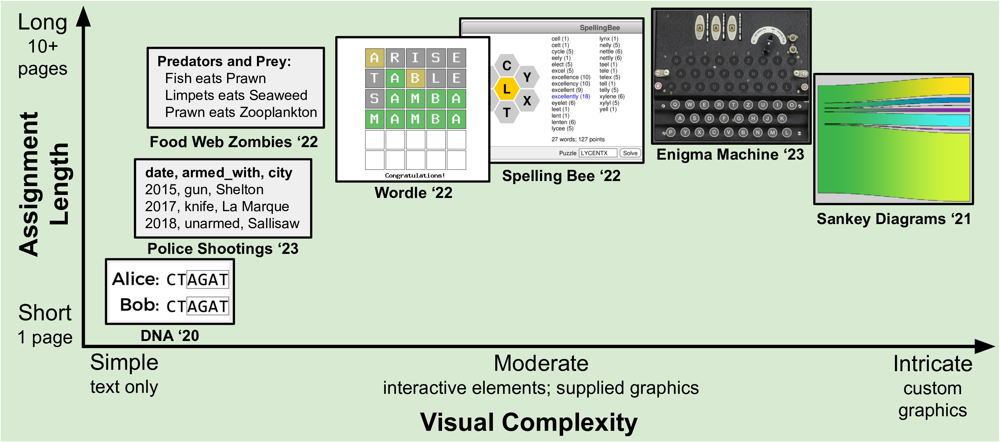

# Designing LLM-Resistant Programming Assignments: Insights and Strategies for CS Educators

This repository contains the experimental framework and data for our SIGCSE 2025 paper investigating Large Language Models' capabilities in solving computer science programming assignments.

[](figures/assignments.png)
*Spectrum of nifty programming assignments across visual complexity and assignment length.*

## Abstract

The rapid advancement of Large Language Models (LLMs) like ChatGPT has raised concerns among computer science educators about how programming assignments should be adapted. This paper explores the capabilities of LLMs (GPT-3.5, GPT-4, and Claude Sonnet) in solving complete, multi-part CS homework assignments from the SIGCSE Nifty Assignments list. Through qualitative and quantitative analysis, we found that LLM performance varied significantly across different assignments and models, with Claude Sonnet consistently outperforming the others. The presence of starter code and test cases improved performance for advanced LLMs, while certain assignments, particularly those involving visual elements, proved challenging for all models. LLMs often disregarded assignment requirements, produced subtly incorrect code, and struggled with context-specific tasks. Based on these findings, we propose strategies for designing LLM-resistant assignments.

## Experimental Setup

### Prerequisites

- Python 3.8+
- OpenAI API access
- Anthropic API access
- PDF processing capabilities (for assignment parsing)

### Environment Configuration

1. Install dependencies:
```bash
pip install -r requirements.txt
```

2. Configure API credentials:
```bash
export OPENAI_API_KEY="your-openai-key"
export ANTHROPIC_API_KEY="your-anthropic-key"
```

## Reproduction Framework

### Single Assignment Analysis

For detailed analysis of individual assignments:

```bash
python process_assignment.py \
  --assignment-folder assignments/wordle/ \
  --output-folder results/wordle \
  --model gpt-4-turbo-preview \
  --prompt-file prompts/level4.txt \
  --exclude-non-pdf false \
  --exclude-tests false
```

### Comprehensive Evaluation

To reproduce the complete experimental results:

```bash
chmod +x run_batch_eval.sh
./run_batch_eval.sh
```

### Results Analysis

Generate publication-quality visualizations:

```bash
python visualize.py
```

## Repository Structure

```
.
├── assignments/          # Curated programming assignments
├── prompts/             # Structured LLM prompts
├── code_utils.py        # Core analysis utilities
├── process_assignment.py # Single assignment processor
├── batch_eval.py        # Batch evaluation framework
├── visualize.py         # Results visualization
└── requirements.txt     # Environment specifications
```

## Citation

If you use this code or methodology in your research, please cite our paper:

```bibtex
@inproceedings{mcdanel2025designing,
  author = {McDanel, Bradley and Novak, Ed},
  title = {Designing LLM-Resistant Programming Assignments: Insights and Strategies for CS Educators},
  year = {2025},
  publisher = {Association for Computing Machinery},
  address = {New York, NY, USA},
  booktitle = {Proceedings of the 56th ACM Technical Symposium on Computer Science Education V. 1},
  pages = {TBD},
  numpages = {7},
  location = {Pittsburgh, PA, USA},
  series = {SIGCSE 2025},
  doi = {10.1145/3641554.3701872},
  isbn = {979-8-4007-0531-1/25/02},
}
```

## Acknowledgments

We thank the SIGCSE community and the creators of the Nifty Assignments repository for their valuable contributions to computer science education.

## License

This research implementation is provided under the MIT License. See LICENSE for details.
